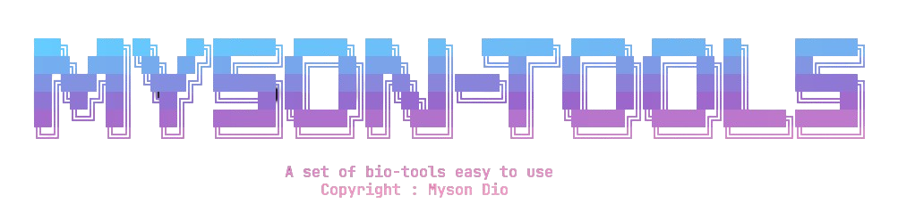
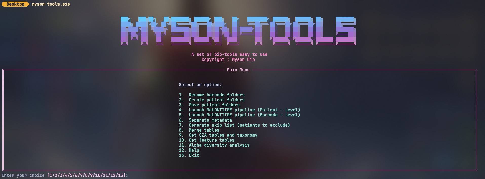

<h1 align="center"> 
     
</h1>


<div align="center">
  


</div>

>A set of easy-to-use bioinformatics tools for folder management, QIIME2 table merging, alpha diversity analysis, and more. Developed by me during my internship at the TBIP laboratory of the University of Guyana which is a biology laboratory.

## Features
- Rename barcode folders
- Create patient folders
- Move patient folders
- Launch MetONTIIME pipeline
- Separate metadata
- Generate skip list
- Merge QIIME2 tables
- Extract QZA tables and taxonomy
- Extract TSV feature tables
- Alpha diversity analysis (Shannon, Simpson, richness, evenness)

## Interactive menu
<h1 align="center"> 
     
</h1>

---

## Installation

Clone the repository:

```sh
git clone https://github.com/gtrZync/myson-tools.git
cd myson-tools
```

### Install (regular mode)

```sh
pip install .
```

**What this does**

* Installs the package into your Python environment
* Code is **copied** into `site-packages`
* Changes to the source code **will NOT** affect the installed package
* Best for **end users** or **production environments**

---

### Install (development mode)

```sh
pip install -e .
```

**What development mode does**

* Installs the package in **editable mode**
* The installed command points to your **working directory**
* Any code changes take effect **immediately**
* Ideal for **development, testing, and debugging**

---

## Environment setup

Before running the tool, create your environment file:

```sh
cp .env.example .env
```

Then edit `.env` and adjust paths for your system:

```sh
nano .env
```
or 
```sh
vim .env
```
also
```sh
code .env
```

---

## Usage

After installation and environment setup, run:

```sh
myson-tools
```

and follow the interactive menu.

If installed in development mode, any changes you make to the source code will be reflected immediately when you rerun the command.

---

### Recommended workflow

| Use case            | Install mode       |
| ------------------- | ------------------ |
| Just using the tool | `pip install .`    |
| Actively developing | `pip install -e .` |
| Server / production | `pip install .`    |

---

<p align="center">
  <a href="https://www.gnu.org/licenses/gpl-3.0.html">
    
  </a>
</p>

<p align="center">
  If you modify or redistribute this software, you must preserve copyright notices,
  provide a copy of the license, indicate if changes were made, and distribute your
  contributions under the same license.
</p>
